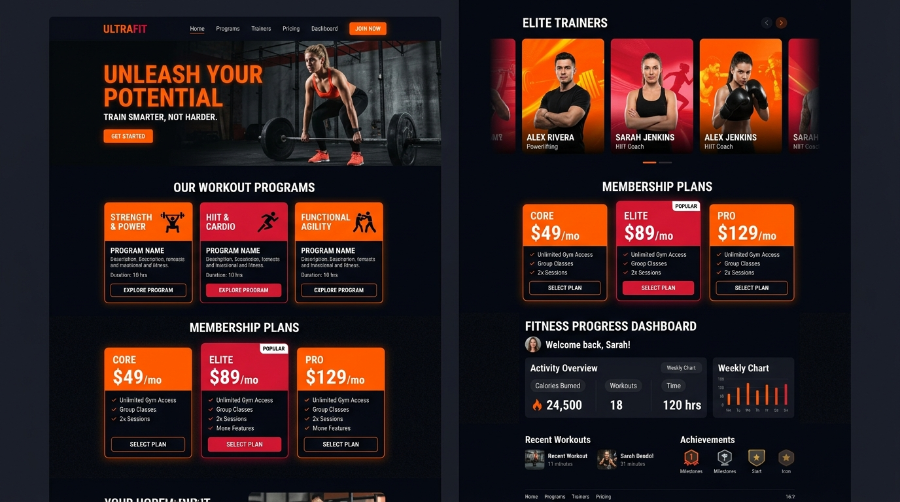

# VG Studio — Software Consultancy & Web Engineering Platform



A high-impact, conversion-focused software consultancy and web engineering landing platform built by **Vinayak Goyal**. Built with HTML5, CSS3, JavaScript (ES6+), and **GSAP 3.12.5 + ScrollTrigger** on top of native browser scrolling with zero scroll desync.

Featuring real-world client solutions including **Rudra Fitness Gym** (Gym & Member Management Platform) and **Shri Radhe Corporation** (Solar Installation & Renewable Energy Consultancy Platform).

---

## 🌟 Key Highlights & Features

- **⚡ Frame-Perfect Native Motion (Zero Desync):** 100% native scroll performance integrated with GSAP ScrollTrigger for buttery 60fps animations.
- **🎨 Editorial Dark Luxury Theme:** Obsidian background (`#07070b`), electric lime (`#c8f065`), neon orange (`#ff5722`), and indigo accents with ambient noise texture.
- **🌌 Interactive Mathematical Hero Canvas:** Floating radial gradient orbs combined with an oscillating grid mesh.
- **🏋️ Featured Client Case Studies:**
  - **Rudra Fitness Gym:** Full-stack workout program directory, trainer rosters, interactive membership calculators, and enrollment funnels.
  - **Shri Radhe Corporation:** Solar energy consultancy corporate portal with rooftop solar showcase, subsidy guides, and energy savings calculator.
  - **NovaNectar Official Portal:** Enterprise agency portal with 35% optimized asset pipeline.
  - **Soil Farming AI Platform:** Predictive soil analysis and agricultural advisory assistant.
  - **Catering & Order Management System:** Real-time event booking and inventory tracking suite.
- **🧲 Magnetic Physics Buttons & Custom Cursor:** Cursor-tracking CTAs with elastic return and dual-ring custom mouse follower.
- **✉️ Working AJAX Consultation Engine:** Integrated FormSubmit API that delivers client consultation requests directly to `vinayakgoyal2208@gmail.com` with instantaneous UI feedback.
- **📱 Responsive Across All Breakpoints:** Hand-crafted mobile drawer and fluid CSS Grid / Flexbox layouts.

---

## 🛠️ Technology Stack

- **Frontend Core:** Semantic HTML5, Vanilla CSS3 (Custom Properties & Design System), Modern JavaScript (ES6+)
- **Choreography & Motion:** [GSAP 3.12.5](https://greensock.com/gsap/), [ScrollTrigger Plugin](https://greensock.com/scrolltrigger/)
- **Typography:** [Syne](https://fonts.google.com/specimen/Syne), [Plus Jakarta Sans](https://fonts.google.com/specimen/Plus+Jakarta+Sans), [Fira Code](https://fonts.google.com/specimen/Fira+Code)
- **Icons:** [Font Awesome 6.5](https://fontawesome.com/)
- **Form Backend:** [FormSubmit AJAX API](https://formsubmit.co/)

---

## 📁 Repository Structure

```text
LandingPage/
├── index.html            # Main semantic HTML structure
├── style.css             # Custom CSS design system & responsive rules
├── script.js             # GSAP timelines, canvas renderer & form logic
├── favicon.png           # Website favicon
├── README.md             # Project documentation
└── Images/               # Optimized imagery & client mockups
    ├── rudra_gym.jpg          # Rudra Fitness Gym mockup
    ├── shri_radhe_solar.jpg   # Shri Radhe Solar mockup
    ├── project1.jpg           # NovaNectar Website
    ├── project3.jpg           # Soil Farming AI Agent
    └── project4.jpg           # Catering & Order Suite
```

---

## 🚀 Quick Setup & Local Run

1. **Clone the repository:**
   ```bash
   git clone https://github.com/VinayakGoyal2208/LandingPage.git
   cd LandingPage
   ```

2. **Open in browser:**
   Open `index.html` directly in any web browser, or launch with a local server:
   ```bash
   python -m http.server 3000
   ```
   Visit `http://localhost:3000`.

---

## 📬 Form Activation Note

The consultation form is connected to `vinayakgoyal2208@gmail.com` via FormSubmit. Upon the first test submission on a live domain, check your inbox to click the one-time **"Activate Form"** verification email.

---

## 👨‍💻 Lead Engineer

**Vinayak Goyal**
- **Role:** Software Consultant & Full-Stack Web Developer | MCA Scholar
- **GitHub:** [@VinayakGoyal2208](https://github.com/VinayakGoyal2208)
- **LinkedIn:** [Vinayak Goyal](https://www.linkedin.com/in/vinayak-goyal-888814221/)
- **Email:** vinayakgoyal2208@gmail.com
- **Phone / WhatsApp:** +91 9410302461

---

## 📜 License

This project is open-source and available under the [MIT License](LICENSE).

---

## LinkedIn Promotion Copy

**Project launch:**

I built VG Studio, my software consultancy and web engineering platform for businesses that need fast, conversion-focused digital products. It features real client work for Rudra Fitness Gym and Shri Radhe Corporation, plus full-stack projects from my professional development journey. The experience uses semantic HTML, custom CSS, native browser scrolling, GSAP ScrollTrigger, an animated canvas, and a working consultation workflow.

**Profile featured section:**

VG Studio is my commercial software consultancy platform, combining frontend engineering, full-stack architecture, motion design, performance optimization, and direct client collaboration. Explore services, real-world case studies, transparent delivery phases, and consultation packages.
